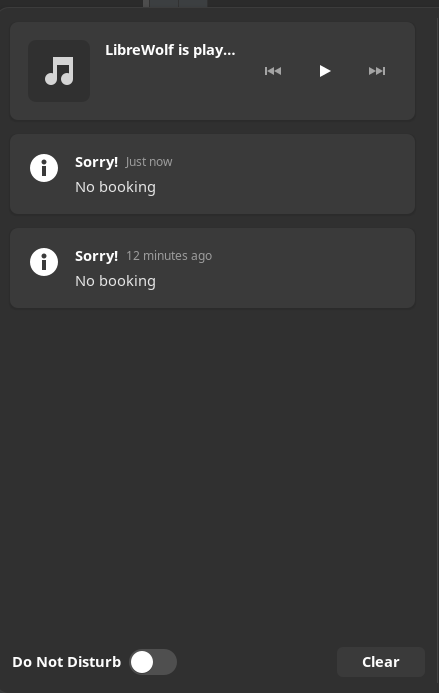

# Zostel Booking notifier

Notifies you when your selected room/dorm type is available for your dates in the Zostel of your choice.
It will send mail to the given Mail id (only when the booking is available) and also send desktop
notifications (for GNOME users only) even when booking is not available.

- Currently, Works with outlook only. (The _FROM_ field should be an Outlook email)
- Desktop Notifications only for GNOME users. When booking is not there, the notifications are of lowest priority and
  thus will only show in notification center and wont popup on screen.
  However, when the booking is available, it will show highest priority notifications for it.
- Just fill all the files inside "data" directory and run.
- There is an example creds_data file. Just fill it with your details and remove ".example".
- **ONLY IF** you want GNOME desktop notifications, You need to get the values of variables
  inside '_env_var_data_' file from your local linux system. Otherwise, leave that file as is.

--- 

### Screenshots

| Booking Available               | Booking Not Available                           |
|---------------------------------|-------------------------------------------------|
| , |  |

--- 

### Get the different Values for 'data' directory

- For _booking_data_, you need to get values from the zostel website by using
  inspect element tool in Firefox.

- For _creds_data_, you need _client_App_Id_, _client_User_Id_ & _authorization_ like you got the
  values of _booking_data_ file. Rest values are self-explanatory. (Don't be a retard)

- If you need desktop notifications in GNOME, you need to fill _env_var_data_ file with
  those environment variable from your local system.

- _mail_data_ file is self-explanatory. (Again, don't be a retard)

### Installation:

1. ##### Clone this repository and enter the directory

```sh
git clone --depth 1 -b master https://github.com/HritwikSinghal/zostel_booking_check
cd zostel_booking_check/
```

2. ##### Install all the requirements.

```sh
pip3 install -r requirements.txt
``` 

### Running the app

```sh
chmod +x main.py
./main.py
```

### Creating cron scirpt to periodically run the app

- Run the crontab editor (```crontab -e```) and enter below command to run this every minute.
  Replace <_path_to_directory_> with appropriate path.

```cron
*/1 * * * * <path_to_directory>/zostel_booking/main.py
```